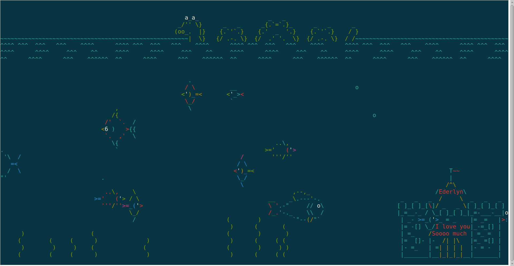

# ILOVEYOU <3

# Installation

	sudo apt-get install libcurses-perl build-essential

	cpan
	# agree to the defaults for everything
	exit

	sudo cpan Term::Animation

# Usage

	./ILOVEYOU

	- or -

	./ILOVEYOU -c		# Enable the classic mode

# While running:

	q	quit
	r	redraw (will recreate all entities)
	p	toggle pause
